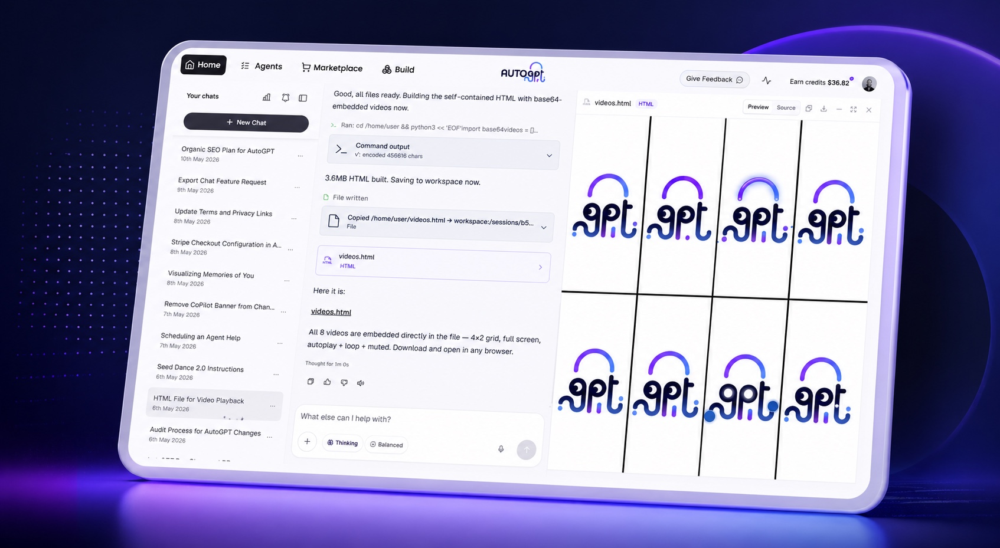
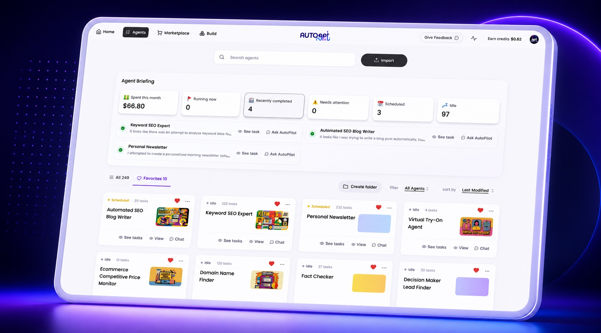
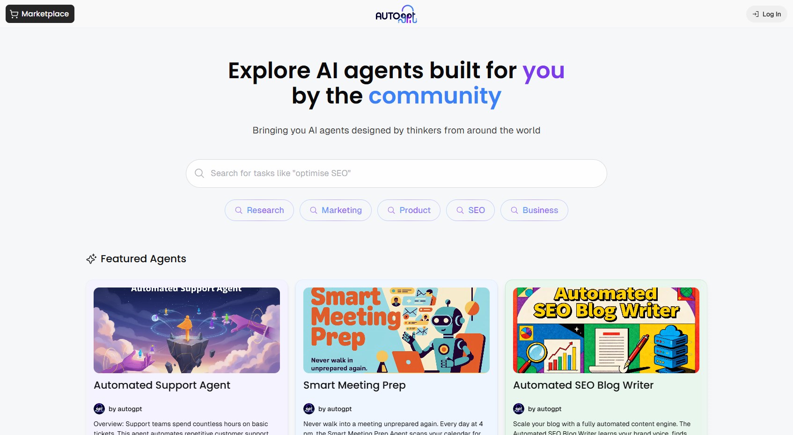
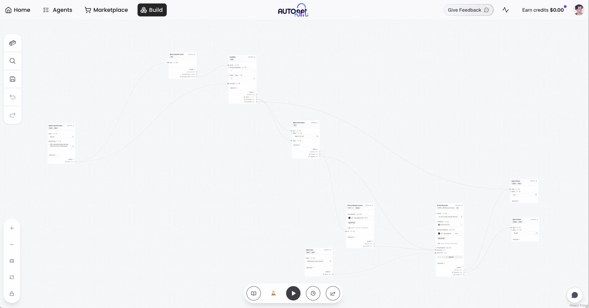

<p align="center">
  <a href="https://platform.agpt.co/signup?utm_source=github&amp;utm_medium=referral&amp;utm_campaign=autogpt_readme&amp;utm_content=hero_banner">
    
  </a>
</p>

<h1 align="center">AutoGPT — AI agents that finish the work</h1>

<p align="center">
  <strong>Get 10 hours back every week.</strong><br />
  Describe what you want done. AutoGPT builds the agent, runs it, and reports back.
</p>

<p align="center">
  <a href="https://platform.agpt.co/signup?utm_source=github&amp;utm_medium=referral&amp;utm_campaign=autogpt_readme&amp;utm_content=header_get_started"><strong>Get started</strong></a>
  ·
  <a href="https://platform.agpt.co/tour?utm_source=github&amp;utm_medium=referral&amp;utm_campaign=autogpt_readme&amp;utm_content=tour_header">Tour</a>
  ·
  <a href="https://agpt.co/pricing?utm_source=github&amp;utm_medium=referral&amp;utm_campaign=autogpt_readme&amp;utm_content=header_pricing">Pricing</a>
  ·
  <a href="https://docs.agpt.co">Docs</a>
  ·
  <a href="https://discord.gg/autogpt">Discord</a>
  ·
  <a href="#self-host-autogpt">Self-host</a>
</p>

<p align="center">
  <a href="https://discord.gg/autogpt">
    
  </a>
  <a href="https://docs.agpt.co">
    
  </a>
</p>

---

## The open-source platform for AI agents

AutoGPT lets you build, deploy, and run AI agents that carry out complete workflows. Describe an outcome in plain English or shape every step in the visual builder, then run the agent on demand, on a schedule, or from a trigger.

**185,000+ GitHub stars. Cited by:**

| | |
|---|---|
| “Next frontier of prompt engineering imo: ‘AutoGPTs’.” | **Andrej Karpathy**, founding member of OpenAI |
| “If you have a phone you can run AutoGPT. You don't even need to learn how to code.” | **Amjad Masad**, co-founder & CEO of Replit |
| “AutoGPT might be the next big step in AI.” | **Lior Alexander**, CEO of AlphaSignal |

---

## Four surfaces, one platform

<table>
  <tr>
    <td width="50%" align="center" valign="top">
      <a href="https://agpt.co/product/autopilot/?utm_source=github&amp;utm_medium=referral&amp;utm_campaign=autogpt_readme&amp;utm_content=autopilot">
        
      </a>
      <br /><strong><a href="https://agpt.co/product/autopilot/?utm_source=github&amp;utm_medium=referral&amp;utm_campaign=autogpt_readme&amp;utm_content=autopilot">AutoPilot</a></strong>
      <br />Describe the job in plain English and turn the conversation into a working agent.
    </td>
    <td width="50%" align="center" valign="top">
      <a href="https://agpt.co/product/agents/?utm_source=github&amp;utm_medium=referral&amp;utm_campaign=autogpt_readme&amp;utm_content=agents">
        
      </a>
      <br /><strong><a href="https://agpt.co/product/agents/?utm_source=github&amp;utm_medium=referral&amp;utm_campaign=autogpt_readme&amp;utm_content=agents">Agents</a></strong>
      <br />See every agent, run, cost, and action that needs your attention.
    </td>
  </tr>
  <tr>
    <td width="50%" align="center" valign="top">
      <a href="https://agpt.co/product/marketplace/?utm_source=github&amp;utm_medium=referral&amp;utm_campaign=autogpt_readme&amp;utm_content=marketplace">
        
      </a>
      <br /><strong><a href="https://agpt.co/product/marketplace/?utm_source=github&amp;utm_medium=referral&amp;utm_campaign=autogpt_readme&amp;utm_content=marketplace">Marketplace</a></strong>
      <br />Start from proven agents, add one to your library, and customize it for your work.
    </td>
    <td width="50%" align="center" valign="top">
      <a href="https://agpt.co/product/build/?utm_source=github&amp;utm_medium=referral&amp;utm_campaign=autogpt_readme&amp;utm_content=build">
        
      </a>
      <br /><strong><a href="https://agpt.co/product/build/?utm_source=github&amp;utm_medium=referral&amp;utm_campaign=autogpt_readme&amp;utm_content=build">Build</a></strong>
      <br />Drag, connect, branch, and inspect blocks for exact control over every step.
    </td>
  </tr>
</table>

---

## Get started

### AutoGPT Platform — public, hosted, and managed

The hosted Platform is publicly available. We manage the infrastructure, model access, credentials, reliability, and updates so you can focus on the work your agents perform.

**[Get started on AutoGPT Platform →](https://platform.agpt.co/signup?utm_source=github&utm_medium=referral&utm_campaign=autogpt_readme&utm_content=platform_get_started)**

[Take the interactive tour →](https://platform.agpt.co/tour?utm_source=github&utm_medium=referral&utm_campaign=autogpt_readme&utm_content=tour_get_started)

- AutoPilot, Agents, Marketplace, and Build
- 45+ connected platforms and hundreds of AI models
- No model API keys or infrastructure setup
- Agents that run on demand, on schedules, and from triggers

The hosted Platform is a paid service with usage-based agent runs. [Compare plans and pricing →](https://agpt.co/pricing?utm_source=github&utm_medium=referral&utm_campaign=autogpt_readme&utm_content=platform_pricing)

### Self-host AutoGPT

> [!NOTE]
> Self-hosting is the free path. You provide the infrastructure and model API keys, and you maintain the deployment. If you want zero setup, use the [managed Platform](https://platform.agpt.co/signup?utm_source=github&utm_medium=referral&utm_campaign=autogpt_readme&utm_content=self_host_note).

**macOS and Linux:**

```bash
curl -fsSL https://setup.agpt.co/install.sh -o install.sh && bash install.sh
```

**Windows PowerShell:**

```powershell
powershell -c "iwr https://setup.agpt.co/install.bat -o install.bat; ./install.bat"
```

[Read the self-hosting guide →](https://docs.agpt.co/platform/getting-started)

---

## Managed Platform vs. self-hosting

| | **AutoGPT Platform** | **Self-hosted** |
|---|---|---|
| Access | Public signup | Clone and install |
| Cost | Paid plan plus agent usage | No license fee; pay your own infrastructure and model providers |
| Setup | Managed | Docker and configuration required |
| Model access | Built in | Bring your own API keys |
| Updates and operations | Managed by AutoGPT | Managed by you |
| Core builder and agent runtime | Included | Included |
| Data and infrastructure control | Hosted by AutoGPT | Runs on your infrastructure |
| Support | Plan-dependent | Community support |

Both paths use the same repository. Choose the managed Platform when you want agents running immediately; self-host when infrastructure control matters more than operational convenience.

---

## Why the hosted Platform is paid

Every agent run consumes real model usage, compute, storage, secrets management, and operational support. The managed Platform covers that infrastructure and funds continued development of the open-source project.

Self-hosting remains available without a license fee for people and teams that want to provide and operate those resources themselves.

---

## What you can automate

| Area | Example |
|---|---|
| **Executive operations** | Prepare a daily brief from internal and external signals |
| **Sales** | Research every account before tomorrow's meetings |
| **Marketing** | Turn a launch brief into campaign drafts across channels |
| **Engineering** | Triage incidents and start with a likely cause |
| **Customer support** | Draft replies, collect context, and flag escalations |
| **Research** | Monitor sources and return structured reports when something changes |

---

## Integrations

Connect the apps that are yours. AutoGPT provides access to hundreds of AI models and connects agents to 45+ platforms, including:

`Gmail` · `Google Calendar` · `Google Docs` · `Google Sheets` · `GitHub` · `Slack` · `Discord` · `Notion` · `HubSpot` · `Linear` · `Airtable` · `Jira` · `Salesforce` · `Stripe` · `Webflow`

[Explore the integrations →](https://agpt.co/docs/integrations)

---

## Community and support

| Resource | Link |
|---|---|
| Discord | [Join the AutoGPT community](https://discord.gg/autogpt) |
| Documentation | [docs.agpt.co](https://docs.agpt.co) |
| Bug reports | [GitHub Issues](https://github.com/Significant-Gravitas/AutoGPT/issues/new/choose) |
| Feature requests | [GitHub Discussions](https://github.com/Significant-Gravitas/AutoGPT/discussions) |
| Contributing | [CONTRIBUTING.md](CONTRIBUTING.md) |

---

## License

| Component | License | What it means |
|---|---|---|
| `autogpt_platform/` | [Polyform Shield](https://polyformproject.org/licenses/shield/1.0.0/) | Free for personal and internal business use; cannot be sold as a competing hosted service |
| `classic/` and everything else | [MIT](LICENSE) | Permissive open-source use |

---

## AutoGPT Classic

Looking for the original standalone AutoGPT agent? It remains available in [`classic/`](classic/) under the MIT License.

- [Build an agent with Forge](classic/FORGE-QUICKSTART.md)
- [Benchmark an agent with `agbenchmark`](https://pypi.org/project/agbenchmark/)
- [Explore the Classic project](classic/README.md)

---

## Contributors

<a href="https://github.com/Significant-Gravitas/AutoGPT/graphs/contributors">
  
</a>

<p align="center">
  <a href="https://platform.agpt.co/signup?utm_source=github&amp;utm_medium=referral&amp;utm_campaign=autogpt_readme&amp;utm_content=footer_get_started"><strong>Get started with AutoGPT →</strong></a>
</p>

---

<!-- Keep these links. Translations will automatically update with the README. -->
[Deutsch](https://zdoc.app/de/Significant-Gravitas/AutoGPT) |
[Español](https://zdoc.app/es/Significant-Gravitas/AutoGPT) |
[français](https://zdoc.app/fr/Significant-Gravitas/AutoGPT) |
[日本語](https://zdoc.app/ja/Significant-Gravitas/AutoGPT) |
[한국어](https://zdoc.app/ko/Significant-Gravitas/AutoGPT) |
[Português](https://zdoc.app/pt/Significant-Gravitas/AutoGPT) |
[Русский](https://zdoc.app/ru/Significant-Gravitas/AutoGPT) |
[中文](https://zdoc.app/zh/Significant-Gravitas/AutoGPT)
